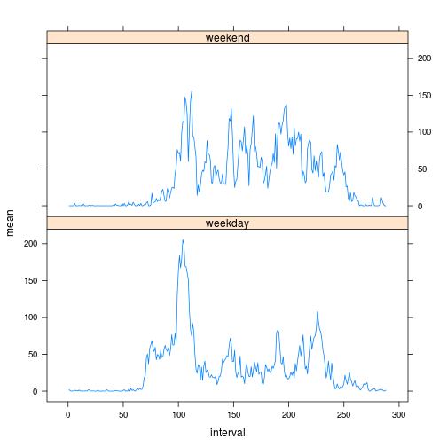

"Reproducible Research: Peer Assessment 1"
=============================================

## Loading and preprocessing the data

```r
data <- read.csv("activity.csv")
```


## What is mean total number of steps taken per day?

Firstly, a vector of total number of steps taken each day is created and then the histogram:

```r
tot_steps <- sapply(split(data$steps,data$date),sum,na.rm=T)
hist(tot_steps,main="Histogram of the total number of steps taken each day",xlab="Number of steps")
```


After that mean and median total steps taken each day is computed:

```r
mean(tot_steps)
```

```
## [1] 9354.23
```

```r
median(tot_steps)
```

```
## [1] 10395
```

## What is the average daily activity pattern?

In this section a time series plot of average number of steps taken every day through each 5-minute intervals is created. Firstly, average of steps across 5-minutes intervals is calculated using `sapply` function on the list of intervals:

```r
Int <- split(data$steps,data$interval) #list of intervals
mean_day_intervals <- sapply(Int,mean,na.rm=T) #average of each 5-minute interval
```

And then the time series plot is drawn:

```r
plot(mean_day_intervals,type="l",main="Time series of average number of steps",xlab="5-minute intervals",ylab="Average number of steps")
```


The maximal value of average number of steps taken every day is find using the variable `max`:

```r
max <- which(mean_day_intervals==max(mean_day_intervals))
```


To find which interval is the maximal one, it's usefull to call the variable max as numeric (the variable without a name):

```r
as.numeric(max)
```

```
## [1] 104
```

Finally, the exact time when the interval begins could be shown:

```r
time <- as.numeric(names(max))
paste(time%/%100,time%%100,sep=":")
```

```
## [1] "8:35"
```


## Imputing missing values

Finding how many of NA values are in data set:

```r
sum(is.na(data$steps))
```

```
## [1] 2304
```

The median of 5-minute intervals will be used to fill in NA values. Firstly, variable `median_day_interval` is made:

```r
median_day_intervals <- sapply(Int,median,na.rm=T) # Int is the list of 5-minute intervals
```

Then the second data set is created

```r
data2 <- data
```

And the new vector without NA values is built in a for-loop 

```r
all_time <- as.numeric(names(Int)) # vector of names of 5-minute intervals
n <- length(all_time) # number of time intervals
Y<-matrix(0,n,length(levels(data$date))) # Matrix for storing number of steps with replaced NAs

for (i in 1:n){                               # For each interval 
    x<-data$steps[data$interval==all_time[i]] # extract number of steps
    x[is.na(x)]<-median_day_intervals[i]      # replace NAs with median
    Y[i,]<-x                                  # store it in i-th row of matrix Y
}
y <- c(Y) # vectorize the matrix of number of steps
```

This vector replace the first column of the new data set

```r
data2$steps <- y
```

Now the new data set is compared using histogram

```r
tot_steps2 <- sapply(split(data2$steps,data2$date),sum,na.rm=T)
hist(tot_steps2,main="Histogram of the total number of steps taken each day",sub="after replacing NA values",xlab="Number of steps")
```


and mean and median total steps taken each day:

```r
mean(tot_steps2)
```

```
## [1] 9503.869
```

```r
median(tot_steps2)
```

```
## [1] 10395
```

Are they same?

```r
mean(tot_steps2)==mean(tot_steps)
```

```
## [1] FALSE
```

```r
median(tot_steps2)==median(tot_steps)
```

```
## [1] TRUE
```

```r
hist(tot_steps,col=rgb(0,0,1,1/4))        # this histogram is light blue             
hist(tot_steps2, col=rgb(1,0,0,1/4), add=T) # this histogram is pink
```


```r
# combination creates purple color
```

Replacing of NA values with median changes the mean but histogram and median of steps remain same.

## Are there differences in activity patterns between weekdays and weekends?

At first dates in data set are changed into Date class:

```r
date <- lapply(data2$date,as.Date,"%Y-%m-%d")
```

Then the number of the day (1 for "Monday", 2 for "Tuesday",..., 0 for "Sunday") is detected

```r
num_d <- sapply(date,format,"%w")
#I didn't use the function 'weekdays()' because it returned the name of a day in my language and I wasn't sure if it would work somewhere else.
```

Finally weekdays and weekends are detected:

```r
day <- rep("weekday",dim(data2)[1]) # vector of "weekday"s
day[num_d==0] <- "weekend" #Sundays and Saturdays are detected
day[num_d==6] <- "weekend"
data2$day <- day # vector of "weekday"s and "weekend"s are added to dataset without NAs
```

Average number of steps in every interval for weekdays and weekends:

```r
Week <- split(data2[,c(1,3)],data2$day) # splitting weekday/weekend
Wday <- Week$weekday
Wend <- Week$weekend
Int_d <- split(Wday$steps,Wday$interval) # splitting according to an interval; weekdays
Int_e <- split(Wend$steps,Wend$interval) # splitting according to an interval; weekends
mean_day <-sapply(Int_d,mean,na.rm=T) # finding average; weekdays
mean_end <-sapply(Int_e,mean,na.rm=T) # finding average; weekends
Days <- data.frame(mean=c(mean_day,mean_end), interval=c(1:n,1:n), 
                   day=c(rep("weekday",n), rep("weekend",n))) #new dataframe for plotting
```

Combined plot of time series:

```r
library(lattice)
xyplot(mean ~ interval | day, data=Days, type="l",layout=c(1,2))
```


